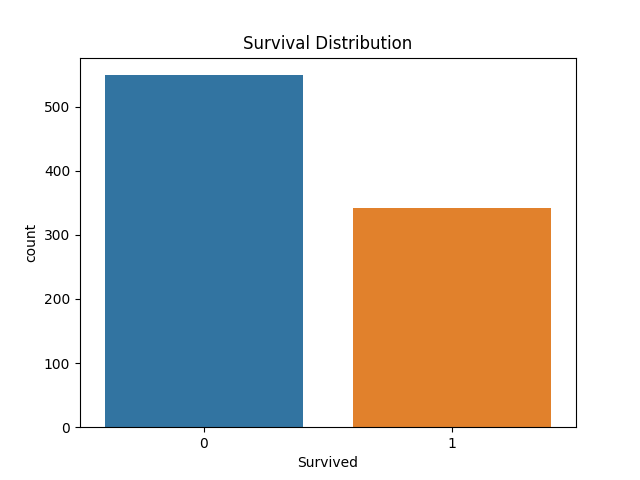
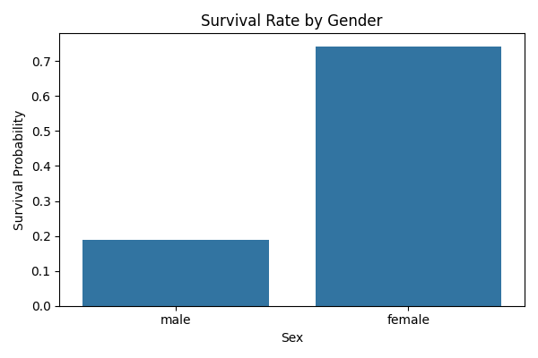
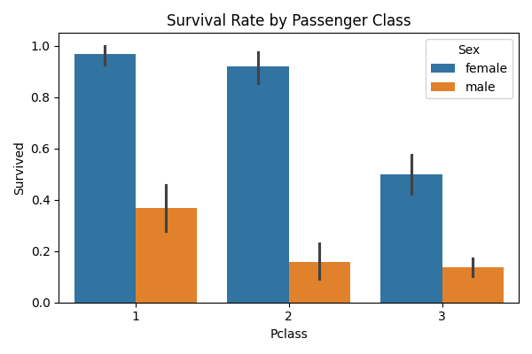

# EDA-1--Titanic
Exploratory Data Analysis on Titanic dataset using Python, Pandas, and visualization to uncover survival patterns.
# 🚢 Titanic Survival Analysis (EDA)

## 📌 Overview

This project performs Exploratory Data Analysis (EDA) on the Titanic dataset to uncover key factors influencing passenger survival.

---

## 🎯 Objective

To analyze patterns in the dataset and identify the most important features affecting survival.

---

## 📊 Key Findings

### 1. Gender Impact

* Female survival rate: ~74%
* Male survival rate: ~19%
  👉 Strong evidence that gender was a major factor in rescue priority.

---

### 2. Passenger Class Impact

* 1st Class: ~63% survival
* 3rd Class: ~24% survival
  👉 Higher socio-economic status increased survival chances.

---

### 3. Age Influence

* Younger passengers had slightly better survival rates
  👉 Age plays a moderate role compared to gender and class.

---

### 4. Data Imbalance

* 62% did not survive
* 38% survived
  👉 Important consideration for ML modeling.

---

## 📸 Visualizations





---

## 🛠️ Tech Stack

* Python
* Pandas
* NumPy
* Seaborn
* Matplotlib

---

## ▶️ How to Run

```bash
git clone https://github.com/SanketGawate01/eda-titanic.git
cd eda-titanic
pip install -r requirements.txt
jupyter notebook
```

---

## 🚀 Future Work

* Feature Engineering
* Build ML model (Logistic Regression)
* Improve prediction accuracy
